# Track Singapore Public Dollars with Network Dashboards

## 1. Overview

Brief overview of the application's purpose and key features Summary of prototyping process and results Key findings and recommendations for full development

## 2. R Package Evaluation

Selected Packages and Justification

Network visualization packages: igraph, visNetwork Data manipulation: dplyr, tidyr Shiny components: shiny, shinydashboard Community detection: igraph algorithms Interactive tables: DT Date handling: lubridate

```{r}
pacman::p_load(tidyverse, dplyr, lubridate, tidyr)
```

## 3. Dataset & Initial EDA

The dataset used for this module is [GeBIZ dataset](https://data.gov.sg/datasets/d_acde1106003906a75c3fa052592f2fcb/view) from [Singapore's open data portal.](https://data.gov.sg/) The data is provided by Ministry of Fiance. It lists all open tenders put out by government agencies since FY2019 (2019 April - 2024 March).

Another dataset is derived from the first module that focuses on Text Analysis and developed for the Group project. This dataset *Labeled_Tenders.csv* contains the tender categories for each tender. The government entity category information was together combined into this data. Therefore, after importing the data, one of the next steps would be to join the data to obtain tender categories and agency types for Network Analysis.

### 3.1 Import data

```{r}
GeBiz_csv <- read_csv("data/GovernmentProcurementviaGeBIZ.csv")
label_data <- read_csv("data/Labeled_Tenders.csv")

```

#### **Glance at the government dataset**

The dataset has 18,638 rows and 7 columns. The 7 columns are *tender_no, tender_description, agency, award_date, tender_detail_status, supplier_name, and awarded_amt.* Among these variables, awarded_amt is numeric type while the rest are all character type.

Note that the award_date is also character_type. We will need to transform the type to date type and do further processing to meet Network Visualisation's needs.

```{r}
glimpse(GeBiz_csv)
```

#### **Glance at the derived data**

The dataset derived from Text Analysis module has 24,438 rows and 15 columns. We noted that the rows are more than the original dataset, so it means that during machine learning process, some of the data was duplicated. Since what we want is to join the LDA_category (tender type) and CATEGORY / SUBCAT (agency type), the duplicated data does not affect us.

```{r}
glimpse(label_data)
```

### 3.2 Data wrangling

#### **3.2.1 Data cleaning**

Before we conduct joint of the dataset, we want to have a quick exploratory data analysis to understand whether the dataset would need further processing before or after joining them. Please see section 3.2 for the preliminary EDA.

The insights we obtained from the EDA is that there are unknown entries for supplier_name with zero amount in awarded_amt. These are actually tenders that fail to have a successful bid. In this case, we will not include it in the network analysis.

What we need to do during data wrangling is to convert dates into date type, filter out the entries that have no tender awarded, as well as add columns for Year, Month and Quarter, as we next may plan to use them for data range selection and analysis variables. During EDA, we find no missing values. So there is no need to handle this.

In the code below, we will achieve these goals mentioned above.

```{r}
#| code-fold: true
#| code-summary: "Show the code"
#filter out Unknown value (no tender awarded)
GeBiz_full <- GeBiz_csv %>%
  filter(supplier_name != "Unknown")

# Convert dates
GeBiz_full$award_date <- as.Date(GeBiz_full$award_date, , format = "%d/%m/%Y")

# Remove white space if have.
GeBiz_full$agency <- trimws(GeBiz_full$agency)
GeBiz_full$supplier_name <- trimws(GeBiz_full$supplier_name)

# Add year and month columns for time-based filtering
GeBiz_addtime <- GeBiz_full %>%
  mutate(award_year = format(award_date, "%Y"),
         month = format(award_date, "%m"),
         year_month = format(award_date, "%Y-%m"),
         quarter = quarters(award_date))
#write_csv(GeBiz_addtime, "GeBiz_add_y_m.csv")
glimpse(GeBiz_addtime)
```

::::: goals
::: goals-header
Note
:::

::: goals-container
-   The data now has 17,855 rows and 11 columns. Less rows from the original dataset because the unknown entries have been removed.
-   Now *award_date* has been converted to *date* type, and the year, month, and quarter have been added to the dataset.
-   In the code above, we managed to save the data as a csv file *eBiz_add_y_m.csv.* This is so when we need further processing during app development, the process is quicker and less computation heavy.
:::
:::::

#### **3.2.2 Join data**

In the earlier section, we have imported two datasets, one of which has the derived columns such as tender category from machine learning and agency type from the government definition. In this step, we will join these columns to be used in the Network Analysis.

```{r}
#| code-fold: true
#| code-summary: "Show the code"
# Match LDA & agency type
network_w_type_data <- GeBiz_addtime %>%

  mutate(row_id = row_number()) %>%
  mutate(tender_cat = label_data$LDA_Category[match(tender_description,
                                                    label_data$tender_description)]) %>%
  mutate(agency_type = label_data$SUBCAT[match(agency,
                                               label_data$agency)]) %>%
  select(-row_id)

glimpse(network_w_type_data)
```

#### **3.2.3 Create RDS file**

Now, we will create a RDS file for Network module use. Within the code below, the related time fields are converted to date or numeric types for use. The agencies, suppliers are assigned a unique ID and type. Edges are created which defines the relationships between agencies and suppliers, and aggregate multiple tenders into single connections.

```{r}
#| code-fold: true
#| code-summary: "Show the code"
# Convert character dates to appropriate types
GeBiz_processed <- network_w_type_data %>%
  mutate(
    # award_date is already a date type, but confirm it
    award_date = as.Date(award_date),
    award_year = as.numeric(award_year),
    month_num = as.numeric(month),
    year_month = paste0(award_year, "-", sprintf("%02d", month_num)),
    year_month_date = as.Date(paste0(year_month, "-01")),
    month_index = award_year * 12 + month_num,
    month_name = month.name[month_num]
  )

# Create Node Dataset 
nodes_df <- bind_rows(
  # Agencies
  GeBiz_processed %>%
    distinct(name = agency) %>%
    mutate(
      type = "agency",
      id = paste0("agency_", row_number())
    ),
  
  # Suppliers
  GeBiz_processed %>%
    distinct(name = supplier_name) %>%
    mutate(
      type = "supplier",
      id = paste0("supplier_", row_number())
    )
) %>%
  # Add aggregated metrics
  left_join(
    GeBiz_processed %>%
      group_by(name = agency) %>%
      summarise(
        total_contracts = n(),
        total_award_amount = sum(awarded_amt),
        first_contract_date = min(award_date),
        last_contract_date = max(award_date)
      ),
    by = "name"
  ) %>%
  left_join(
    GeBiz_processed %>%
      group_by(name = supplier_name) %>%
      summarise(
        total_contracts = n(),
        total_award_amount = sum(awarded_amt),
        first_contract_date = min(award_date),
        last_contract_date = max(award_date)
      ),
    by = "name", 
    suffix = c("_agency", "_supplier")
  ) %>%
  # Combine metrics
  mutate(
    total_contracts = coalesce(total_contracts_agency, total_contracts_supplier),
    total_award_amount = coalesce(total_award_amount_agency, total_award_amount_supplier),
    first_contract_date = coalesce(first_contract_date_agency, first_contract_date_supplier),
    last_contract_date = coalesce(last_contract_date_agency, last_contract_date_supplier)
  ) %>%
  select(-ends_with(c("_agency", "_supplier")))

# Update Edge Dataset to use new IDs
edges_df <- GeBiz_processed %>%
  # Aggregate edges
  group_by(agency, supplier_name) %>%
  summarise(
    total_contracts = n(),
    total_award_amount = sum(awarded_amt),
    first_contract_date = min(award_date),
    last_contract_date = max(award_date),
    tender_cat = paste(unique(tender_cat), collapse = ", ")
  ) %>%
  # Join with node IDs
  left_join(
    nodes_df %>% 
      filter(type == "agency") %>% 
      select(from_id = id, from_name = name),
    by = c("agency" = "from_name")
  ) %>%
  left_join(
    nodes_df %>% 
      filter(type == "supplier") %>% 
      select(to_id = id, to_name = name),
    by = c("supplier_name" = "to_name")
  ) %>%
  ungroup()


# Add monthly edges breakdown
monthly_edges_df <- GeBiz_processed %>%
  group_by(agency, supplier_name, year_month, award_year, month_num, month_name) %>%
  summarise(
    total_contracts = n(),
    total_award_amount = sum(awarded_amt),
    month_index = first(month_index),
    .groups = "drop"
  )

# Create a months reference table for filtering
months_table <- GeBiz_processed %>%
  distinct(year_month, award_year, month_num, month_name, month_index) %>%
  arrange(month_index) %>%
  mutate(
    # Create a nice display label
    display_label = paste0(month_name, " ", award_year)
  )

# Create agency_types data frame - explicit mapping between agencies and their types
agency_types <- GeBiz_processed %>%
  distinct(agency, agency_type) %>%
  filter(!is.na(agency_type))

# Save the complete network data
network_data <- list(
  nodes = nodes_df,
  edges = edges_df,
  monthly_edges = monthly_edges_df,
  months = months_table,
  agency_types = agency_types,
  time_info = list(
    years = unique(GeBiz_processed$award_year),
    months = unique(GeBiz_processed$year_month),
    min_date = min(GeBiz_processed$award_date),
    max_date = max(GeBiz_processed$award_date),
    month_range = range(GeBiz_processed$month_index)  
))

```

### 3.2 EDA to understand the dataset

The EDA is parked in a different page for reference. The purpose is to understand the general information of this dataset to process data cleaning and structuring.

## 4 Module design

### 4.1 Design thinking

What I discovered about the network structure is that it is a directional dataset where the from node is always an agency and to node is always a supplier. This will construct an interesting network where the supplier nodes will be revolving the agency node. The communities are also easier to form with one or several agencies in the centre. Although this is the assumption, but this leads to separation of visualisation design that we will separate the overall network view and community network view.

### 4.2 Network Module Architecture

\[diagram\]

*Node-Edge Structure Creation*

Agencies and suppliers are represented as nodes Procurement contracts form edges between them Node types are visually distinguished (agencies as diamonds, suppliers as circles)

### 4.3 SG Procurement Network Overview

In this module, 2 tabs are designed to illustrate a network overview and zoom-in view for a focused node and its connected nodes.

#### **4.3.1 Network Plot**

The network visualisation allows users to select date ranges and display methods to clearly see relationships between agencies and suppliers. Tooltips show important information like node names, number of contracts, and total award amounts, helping users quickly understand the key details about the connections they're viewing.

::::: goals
::: goals-header
Design features / functionality
:::

::: goals-container
-   Interactive network visualisation: Agency-supplier relationship
-   Network metrics dashboard: Agency, Supplier, Top contracts
-   **Filtering and control panel**: Data range, Agency type, Agency, Supplier, Tender category, Awaerd amount range, Maximum edges, Edge thickness options, Network layout, and node size option.
:::
:::::

#### **Prototypes**

::: panel-tabset
## Firce-directed

```{r}
#| code-fold: true
#| code-summary: "Show the code"
library(dplyr)
library(visNetwork)
library(igraph)
library(scales)


network_data <- readRDS("data/m3_processed_network_data.rds")
nodes <- network_data$nodes
edges <- network_data$edges
agency_types <- network_data$agency_types

min_award <- 0 
max_award <- 100 

# Filter edges by award amount
edges <- edges %>%
  filter(total_award_amount >= min_award & total_award_amount <= max_award)

max_edges <- 300  
if(nrow(edges) > max_edges) {
  edges <- edges %>%
    arrange(desc(total_award_amount)) %>%
    slice_head(n = max_edges)
}

connected_nodes <- unique(c(edges$agency, edges$supplier_name))
nodes <- nodes %>%
  filter(name %in% connected_nodes)

# -----------------------------------------
# Prepare visualisation data
# -----------------------------------------
# Prepare nodes 
nodes_vis <- nodes %>%
  mutate(
    id = name,
    label = name,
    color = case_when(
      type == "agency" ~ "#A6CDC6",  
      type == "supplier" ~ "#E4003A", 
      TRUE ~ "#999999"               
    ),
    shape = case_when(
      type == "agency" ~ "diamond",
      type == "supplier" ~ "dot",
      TRUE ~ "dot"
    ),
    title = paste0(
      "<strong>", name, "</strong><br>",
      "Type: ", type, "<br>",
      "Total Contracts: ", total_contracts, "<br>",
      "Total Award Amount: $", 
      format(total_award_amount, big.mark = ",", scientific = FALSE),
      "<br>First Contract: ", first_contract_date,
      "<br>Last Contract: ", last_contract_date
    )
  )

# Calculate and add degree centrality for node sizing
graph <- igraph::graph_from_data_frame(
  d = data.frame(from = edges$agency, to = edges$supplier_name),
  directed = TRUE
)

# Calculate degree centrality
degrees <- igraph::degree(graph, mode = "all")

# Match degree values to nodes
nodes_vis$degree <- 0  # Default value
for(i in 1:nrow(nodes_vis)) {
  if(nodes_vis$id[i] %in% names(degrees)) {
    nodes_vis$degree[i] <- degrees[nodes_vis$id[i]]
  }
}

# Scale node sizes based on degree
if(length(unique(nodes_vis$degree)) > 1) {
  log_degrees <- log1p(nodes_vis$degree)
  nodes_vis$size <- 10 + (log_degrees - min(log_degrees)) / 
                  (max(log_degrees) - min(log_degrees)) * 25
} else {
  nodes_vis$size <- 15
}

nodes_vis$title <- paste0(
  nodes_vis$title,
  "<br>Connections: ", nodes_vis$degree
)

# Prepare edges for visualization
edges_vis <- edges %>%
  mutate(
    from = agency,
    to = supplier_name,
    # Scale edge thickness based on award amount
    value = rescale(total_award_amount, to = c(1, 8)),
    title = paste0(
      "<strong>Agency-Supplier Connection</strong><br>",
      "Agency: ", agency, "<br>",
      "Supplier: ", supplier_name, "<br>",
      "Total Contracts: ", total_contracts, "<br>",
      "Total Award Amount: $", 
      format(total_award_amount, big.mark = ",", scientific = FALSE)
    )
  )

# Create network visualization
network_vis <- visNetwork(nodes_vis, edges_vis, width = "100%", height = "700px") %>%
  visNodes(
    shadow = TRUE
  ) %>%
  visEdges(
    arrows = "to",
    color = list(
      color = "#D3D3D3",
      highlight = "#FF0000"
    ),
    smooth = TRUE
  ) %>%
  visOptions(
    highlightNearest = list(enabled = TRUE, degree = 1, hover = TRUE),
    nodesIdSelection = TRUE
  ) %>%
  visInteraction(
    navigationButtons = TRUE,
    dragNodes = TRUE,
    zoomView = TRUE
  ) %>%
  visPhysics(
    solver = "forceAtlas2Based",
    stabilization = list(enabled = TRUE, iterations = 200)
  ) %>%
  visLayout(randomSeed = 123)  # For consistent layout


network_vis
```

## Repulsion

```{r}
#| code-fold: true
#| code-summary: "Show the code"
library(dplyr)
library(visNetwork)
library(igraph)
library(scales)


network_data <- readRDS("data/m3_processed_network_data.rds")
nodes <- network_data$nodes
edges <- network_data$edges
agency_types <- network_data$agency_types

min_award <- 0 
max_award <- 100 

# Filter edges by award amount
edges <- edges %>%
  filter(total_award_amount >= min_award & total_award_amount <= max_award)

max_edges <- 300  
if(nrow(edges) > max_edges) {
  edges <- edges %>%
    arrange(desc(total_award_amount)) %>%
    slice_head(n = max_edges)
}

connected_nodes <- unique(c(edges$agency, edges$supplier_name))
nodes <- nodes %>%
  filter(name %in% connected_nodes)

# -----------------------------------------
# Prepare visualisation data
# -----------------------------------------
# Prepare nodes 
nodes_vis <- nodes %>%
  mutate(
    id = name,
    label = name,
    color = case_when(
      type == "agency" ~ "#A6CDC6",  
      type == "supplier" ~ "#E4003A", 
      TRUE ~ "#999999"               
    ),
    shape = case_when(
      type == "agency" ~ "diamond",
      type == "supplier" ~ "dot",
      TRUE ~ "dot"
    ),
    title = paste0(
      "<strong>", name, "</strong><br>",
      "Type: ", type, "<br>",
      "Total Contracts: ", total_contracts, "<br>",
      "Total Award Amount: $", 
      format(total_award_amount, big.mark = ",", scientific = FALSE),
      "<br>First Contract: ", first_contract_date,
      "<br>Last Contract: ", last_contract_date
    )
  )

# Calculate and add degree centrality for node sizing
graph <- igraph::graph_from_data_frame(
  d = data.frame(from = edges$agency, to = edges$supplier_name),
  directed = TRUE
)

# Calculate degree centrality
degrees <- igraph::degree(graph, mode = "all")

# Match degree values to nodes
nodes_vis$degree <- 0  # Default value
for(i in 1:nrow(nodes_vis)) {
  if(nodes_vis$id[i] %in% names(degrees)) {
    nodes_vis$degree[i] <- degrees[nodes_vis$id[i]]
  }
}

# Scale node sizes based on degree
if(length(unique(nodes_vis$degree)) > 1) {
  log_degrees <- log1p(nodes_vis$degree)
  nodes_vis$size <- 10 + (log_degrees - min(log_degrees)) / 
                  (max(log_degrees) - min(log_degrees)) * 25
} else {
  nodes_vis$size <- 15
}

nodes_vis$title <- paste0(
  nodes_vis$title,
  "<br>Connections: ", nodes_vis$degree
)

# Prepare edges for visualization
edges_vis <- edges %>%
  mutate(
    from = agency,
    to = supplier_name,
    # Scale edge thickness based on award amount
    value = rescale(total_award_amount, to = c(1, 8)),
    title = paste0(
      "<strong>Agency-Supplier Connection</strong><br>",
      "Agency: ", agency, "<br>",
      "Supplier: ", supplier_name, "<br>",
      "Total Contracts: ", total_contracts, "<br>",
      "Total Award Amount: $", 
      format(total_award_amount, big.mark = ",", scientific = FALSE)
    )
  )

# Create network visualization
network_vis <- visNetwork(nodes_vis, edges_vis, width = "100%", height = "700px") %>%
  visNodes(
    shadow = TRUE
  ) %>%
  visEdges(
    arrows = "to",
    color = list(
      color = "#D3D3D3",
      highlight = "#FF0000"
    ),
    smooth = TRUE
  ) %>%
  visOptions(
    highlightNearest = list(enabled = TRUE, degree = 1, hover = TRUE),
    nodesIdSelection = TRUE
  ) %>%
  visInteraction(
    navigationButtons = TRUE,
    dragNodes = TRUE,
    zoomView = TRUE
  ) %>%
  visPhysics(
    solver = "repulsion",
    stabilization = list(enabled = TRUE, iterations = 200)
  ) %>%
  visLayout(randomSeed = 123)  # For consistent layout

network_vis
```

## barnesHut

```{r}
#| code-fold: true
#| code-summary: "Show the code"
library(dplyr)
library(visNetwork)
library(igraph)
library(scales)


network_data <- readRDS("data/m3_processed_network_data.rds")
nodes <- network_data$nodes
edges <- network_data$edges
agency_types <- network_data$agency_types

min_award <- 0 
max_award <- 100 

# Filter edges by award amount
edges <- edges %>%
  filter(total_award_amount >= min_award & total_award_amount <= max_award)

max_edges <- 300  
if(nrow(edges) > max_edges) {
  edges <- edges %>%
    arrange(desc(total_award_amount)) %>%
    slice_head(n = max_edges)
}

connected_nodes <- unique(c(edges$agency, edges$supplier_name))
nodes <- nodes %>%
  filter(name %in% connected_nodes)

# -----------------------------------------
# Prepare visualisation data
# -----------------------------------------
# Prepare nodes 
nodes_vis <- nodes %>%
  mutate(
    id = name,
    label = name,
    color = case_when(
      type == "agency" ~ "#A6CDC6",  
      type == "supplier" ~ "#E4003A", 
      TRUE ~ "#999999"               
    ),
    shape = case_when(
      type == "agency" ~ "diamond",
      type == "supplier" ~ "dot",
      TRUE ~ "dot"
    ),
    title = paste0(
      "<strong>", name, "</strong><br>",
      "Type: ", type, "<br>",
      "Total Contracts: ", total_contracts, "<br>",
      "Total Award Amount: $", 
      format(total_award_amount, big.mark = ",", scientific = FALSE),
      "<br>First Contract: ", first_contract_date,
      "<br>Last Contract: ", last_contract_date
    )
  )

# Calculate and add degree centrality for node sizing
graph <- igraph::graph_from_data_frame(
  d = data.frame(from = edges$agency, to = edges$supplier_name),
  directed = TRUE
)

# Calculate degree centrality
degrees <- igraph::degree(graph, mode = "all")

# Match degree values to nodes
nodes_vis$degree <- 0  # Default value
for(i in 1:nrow(nodes_vis)) {
  if(nodes_vis$id[i] %in% names(degrees)) {
    nodes_vis$degree[i] <- degrees[nodes_vis$id[i]]
  }
}

# Scale node sizes based on degree
if(length(unique(nodes_vis$degree)) > 1) {
  log_degrees <- log1p(nodes_vis$degree)
  nodes_vis$size <- 10 + (log_degrees - min(log_degrees)) / 
                  (max(log_degrees) - min(log_degrees)) * 25
} else {
  nodes_vis$size <- 15
}

nodes_vis$title <- paste0(
  nodes_vis$title,
  "<br>Connections: ", nodes_vis$degree
)

# Prepare edges for visualization
edges_vis <- edges %>%
  mutate(
    from = agency,
    to = supplier_name,
    # Scale edge thickness based on award amount
    value = rescale(total_award_amount, to = c(1, 8)),
    title = paste0(
      "<strong>Agency-Supplier Connection</strong><br>",
      "Agency: ", agency, "<br>",
      "Supplier: ", supplier_name, "<br>",
      "Total Contracts: ", total_contracts, "<br>",
      "Total Award Amount: $", 
      format(total_award_amount, big.mark = ",", scientific = FALSE)
    )
  )

# Create network visualization
network_vis <- visNetwork(nodes_vis, edges_vis, width = "100%", height = "700px") %>%
  visNodes(
    shadow = TRUE
  ) %>%
  visEdges(
    arrows = "to",
    color = list(
      color = "#D3D3D3",
      highlight = "#FF0000"
    ),
    smooth = TRUE
  ) %>%
  visOptions(
    highlightNearest = list(enabled = TRUE, degree = 1, hover = TRUE),
    nodesIdSelection = TRUE
  ) %>%
  visInteraction(
    navigationButtons = TRUE,
    dragNodes = TRUE,
    zoomView = TRUE
  ) %>%
  visPhysics(
    solver = "barnesHut",
    stabilization = list(enabled = TRUE, iterations = 200)
  ) %>%
  visLayout(randomSeed = 123)  # For consistent layout

network_vis
```

## hierarchicalRepulsion

```{r}
#| code-fold: true
#| code-summary: "Show the code"
library(dplyr)
library(visNetwork)
library(igraph)
library(scales)


network_data <- readRDS("data/m3_processed_network_data.rds")
nodes <- network_data$nodes
edges <- network_data$edges
agency_types <- network_data$agency_types

min_award <- 0 
max_award <- 100 

# Filter edges by award amount
edges <- edges %>%
  filter(total_award_amount >= min_award & total_award_amount <= max_award)

max_edges <- 300  
if(nrow(edges) > max_edges) {
  edges <- edges %>%
    arrange(desc(total_award_amount)) %>%
    slice_head(n = max_edges)
}

connected_nodes <- unique(c(edges$agency, edges$supplier_name))
nodes <- nodes %>%
  filter(name %in% connected_nodes)

# -----------------------------------------
# Prepare visualisation data
# -----------------------------------------
# Prepare nodes 
nodes_vis <- nodes %>%
  mutate(
    id = name,
    label = name,
    color = case_when(
      type == "agency" ~ "#A6CDC6",  
      type == "supplier" ~ "#E4003A", 
      TRUE ~ "#999999"               
    ),
    shape = case_when(
      type == "agency" ~ "diamond",
      type == "supplier" ~ "dot",
      TRUE ~ "dot"
    ),
    title = paste0(
      "<strong>", name, "</strong><br>",
      "Type: ", type, "<br>",
      "Total Contracts: ", total_contracts, "<br>",
      "Total Award Amount: $", 
      format(total_award_amount, big.mark = ",", scientific = FALSE),
      "<br>First Contract: ", first_contract_date,
      "<br>Last Contract: ", last_contract_date
    )
  )

# Calculate and add degree centrality for node sizing
graph <- igraph::graph_from_data_frame(
  d = data.frame(from = edges$agency, to = edges$supplier_name),
  directed = TRUE
)

# Calculate degree centrality
degrees <- igraph::degree(graph, mode = "all")

# Match degree values to nodes
nodes_vis$degree <- 0  # Default value
for(i in 1:nrow(nodes_vis)) {
  if(nodes_vis$id[i] %in% names(degrees)) {
    nodes_vis$degree[i] <- degrees[nodes_vis$id[i]]
  }
}

# Scale node sizes based on degree
if(length(unique(nodes_vis$degree)) > 1) {
  log_degrees <- log1p(nodes_vis$degree)
  nodes_vis$size <- 10 + (log_degrees - min(log_degrees)) / 
                  (max(log_degrees) - min(log_degrees)) * 25
} else {
  nodes_vis$size <- 15
}

nodes_vis$title <- paste0(
  nodes_vis$title,
  "<br>Connections: ", nodes_vis$degree
)

# Prepare edges for visualization
edges_vis <- edges %>%
  mutate(
    from = agency,
    to = supplier_name,
    # Scale edge thickness based on award amount
    value = rescale(total_award_amount, to = c(1, 8)),
    title = paste0(
      "<strong>Agency-Supplier Connection</strong><br>",
      "Agency: ", agency, "<br>",
      "Supplier: ", supplier_name, "<br>",
      "Total Contracts: ", total_contracts, "<br>",
      "Total Award Amount: $", 
      format(total_award_amount, big.mark = ",", scientific = FALSE)
    )
  )

# Create network visualization
network_vis <- visNetwork(nodes_vis, edges_vis, width = "100%", height = "700px") %>%
  visNodes(
    shadow = TRUE
  ) %>%
  visEdges(
    arrows = "to",
    color = list(
      color = "#D3D3D3",
      highlight = "#FF0000"
    ),
    smooth = TRUE
  ) %>%
  visOptions(
    highlightNearest = list(enabled = TRUE, degree = 1, hover = TRUE),
    nodesIdSelection = TRUE
  ) %>%
  visInteraction(
    navigationButtons = TRUE,
    dragNodes = TRUE,
    zoomView = TRUE
  ) %>%
  visPhysics(
    solver = "hierarchicalRepulsion",
    stabilization = list(enabled = TRUE, iterations = 200)
  ) %>%
  visLayout(randomSeed = 123)  # For consistent layout

network_vis
```

## Award amt & Edges ++

```{r}
#| code-fold: true
#| code-summary: "Show the code"
library(dplyr)
library(visNetwork)
library(igraph)
library(scales)


network_data <- readRDS("data/m3_processed_network_data.rds")
nodes <- network_data$nodes
edges <- network_data$edges
agency_types <- network_data$agency_types

min_award <- 1000000
max_award <- 10000000 

# Filter edges by award amount
edges <- edges %>%
  filter(total_award_amount >= min_award & total_award_amount <= max_award)

max_edges <- 1500  
if(nrow(edges) > max_edges) {
  edges <- edges %>%
    arrange(desc(total_award_amount)) %>%
    slice_head(n = max_edges)
}

connected_nodes <- unique(c(edges$agency, edges$supplier_name))
nodes <- nodes %>%
  filter(name %in% connected_nodes)

# -----------------------------------------
# Prepare visualisation data
# -----------------------------------------
# Prepare nodes 
nodes_vis <- nodes %>%
  mutate(
    id = name,
    label = name,
    color = case_when(
      type == "agency" ~ "#A6CDC6",  
      type == "supplier" ~ "#E4003A", 
      TRUE ~ "#999999"               
    ),
    shape = case_when(
      type == "agency" ~ "diamond",
      type == "supplier" ~ "dot",
      TRUE ~ "dot"
    ),
    title = paste0(
      "<strong>", name, "</strong><br>",
      "Type: ", type, "<br>",
      "Total Contracts: ", total_contracts, "<br>",
      "Total Award Amount: $", 
      format(total_award_amount, big.mark = ",", scientific = FALSE),
      "<br>First Contract: ", first_contract_date,
      "<br>Last Contract: ", last_contract_date
    )
  )

# Calculate and add degree centrality for node sizing
graph <- igraph::graph_from_data_frame(
  d = data.frame(from = edges$agency, to = edges$supplier_name),
  directed = TRUE
)

# Calculate degree centrality
degrees <- igraph::degree(graph, mode = "all")

# Match degree values to nodes
nodes_vis$degree <- 0  # Default value
for(i in 1:nrow(nodes_vis)) {
  if(nodes_vis$id[i] %in% names(degrees)) {
    nodes_vis$degree[i] <- degrees[nodes_vis$id[i]]
  }
}

# Scale node sizes based on degree
if(length(unique(nodes_vis$degree)) > 1) {
  log_degrees <- log1p(nodes_vis$degree)
  nodes_vis$size <- 10 + (log_degrees - min(log_degrees)) / 
                  (max(log_degrees) - min(log_degrees)) * 25
} else {
  nodes_vis$size <- 15
}

nodes_vis$title <- paste0(
  nodes_vis$title,
  "<br>Connections: ", nodes_vis$degree
)

# Prepare edges for visualization
edges_vis <- edges %>%
  mutate(
    from = agency,
    to = supplier_name,
    # Scale edge thickness based on award amount
    value = rescale(total_award_amount, to = c(1, 8)),
    title = paste0(
      "<strong>Agency-Supplier Connection</strong><br>",
      "Agency: ", agency, "<br>",
      "Supplier: ", supplier_name, "<br>",
      "Total Contracts: ", total_contracts, "<br>",
      "Total Award Amount: $", 
      format(total_award_amount, big.mark = ",", scientific = FALSE)
    )
  )

# Create network visualization
network_vis <- visNetwork(nodes_vis, edges_vis, width = "100%", height = "700px") %>%
  visNodes(
    shadow = TRUE
  ) %>%
  visEdges(
    arrows = "to",
    color = list(
      color = "#D3D3D3",
      highlight = "#FF0000"
    ),
    smooth = TRUE
  ) %>%
  visOptions(
    highlightNearest = list(enabled = TRUE, degree = 1, hover = TRUE),
    nodesIdSelection = TRUE
  ) %>%
  visInteraction(
    navigationButtons = TRUE,
    dragNodes = TRUE,
    zoomView = TRUE
  ) %>%
  visPhysics(
    solver = "forceAtlas2Based",
    stabilization = list(enabled = TRUE, iterations = 200)
  ) %>%
  visLayout(randomSeed = 123)  # For consistent layout


network_vis
```
:::

#### **4.3.2 Ego centric plot**

The Ego centric network visualisation allows users to zoom in to a selected node without distractions. Tooltips show important information like node names, type, number of contracts, and total award amounts, helping users quickly understand the key details about the connections they're viewing. There will also be a metric table providing detailed information of the nodes and edges.

::::: goals
::: goals-header
Design features / functionality
:::

::: goals-container
-   Interactive network visualisation: Relationship of ego node and all of its connections
-   Network metrics dashboard: Agency, Supplier, Connections
-   Only appears when a node is selected from the main network plot
:::
:::::

#### **Prototypes**

::: panel-tabset
## Ego Agency

```{r}
#| code-fold: true
#| code-summary: "Show the code"
library(dplyr)
library(visNetwork)
library(scales)

plot_ego_network <- function(network_data, selected_node) {
  nodes <- network_data$nodes
  edges <- network_data$edges
  
  if(selected_node %in% nodes$name[nodes$type == "agency"]) {
    # Agency selected
    ego_edges <- edges %>% filter(agency == selected_node)
    # CHANGE 2: PROPERLY COLLECT ALL CONNECTED NODES FOR AN AGENCY
    connected_nodes <- unique(c(selected_node, ego_edges$supplier_name))
    node_type <- "agency"
  } else if(selected_node %in% nodes$name[nodes$type == "supplier"]) {
    # Supplier selected
    ego_edges <- edges %>% filter(supplier_name == selected_node)
    # CHANGE 3: PROPERLY COLLECT ALL CONNECTED NODES FOR A SUPPLIER
    connected_nodes <- unique(c(selected_node, ego_edges$agency))
    node_type <- "supplier"
  } else {
    # CHANGE 4: IMPROVED ERROR MESSAGE
    stop("Selected node not found in network data or node type is ambiguous")
  }
  
  all_connected <- c(connected_nodes, selected_node)
  
  ego_nodes <- nodes %>% filter(name %in% connected_nodes)
  
  # Prepare nodes 
  nodes_vis <- ego_nodes %>%
    mutate(
      id = name,
      label = name,
      # Replicate the exact color scheme from the Shiny app
      color = case_when(
        name == selected_node ~ "#F3c623",  
        type == "supplier" ~ "#E4003A",     
        type == "agency" ~ "#A6CDC6",       
        TRUE ~ "#999999"                    
      ),
      shape = case_when(
        name == selected_node ~ "star",     
        type == "supplier" ~ "dot",         
        type == "agency" ~ "diamond",       
        TRUE ~ "dot"                        
      ),
      size = ifelse(name == selected_node, 35, 20),
      # Tooltip
      title = paste0(
        "<strong>", name, "</strong><br>",
        "Type: ", type, "<br>",
        "Total Contracts: ", total_contracts, "<br>",
        "Total Award Amount: S$", 
        format(total_award_amount, big.mark = ",", scientific = FALSE)
      )
    )
  
  # Prepare edges 
  edges_vis <- ego_edges %>%
    mutate(
      from = agency,
      to = supplier_name,
      # Scale edge thickness based on award amount
      value = rescale(total_award_amount, to = c(1, 10)),
      # Edge tooltip
      title = paste0(
        "Agency: ", agency, "<br>",
        "Supplier: ", supplier_name, "<br>",
        "Total Contracts: ", total_contracts, "<br>",
        "Total Award Amount: S$", 
        format(total_award_amount, big.mark = ",", scientific = FALSE)
      )
    )
  
  visNetwork(nodes_vis, edges_vis) %>%
    visEdges(
      arrows = "to",
      color = list(
        color = "#D3D3D3",
        highlight = "#FF0000"
      ),
      smooth = TRUE
    ) %>%
    visOptions(
      highlightNearest = list(enabled = TRUE, degree = 1, hover = TRUE)
    ) %>%
    visPhysics(
      solver = "forceAtlas2Based",
      stabilization = list(enabled = TRUE, iterations = 500)
    ) %>%
    visInteraction(
      navigationButtons = TRUE,
      dragNodes = TRUE,
      zoomView = TRUE
    ) %>%
    visLayout(randomSeed = 123)  # Consistent layout
}


supplier <- network_data$edges$supplier_name[1]

plot_ego_network(network_data, supplier)
```

## Ego Supplier

```{r}
#| code-fold: true
#| code-summary: "Show the code"
library(dplyr)
library(visNetwork)
library(scales)

plot_ego_network <- function(network_data, selected_node) {
  nodes <- network_data$nodes
  edges <- network_data$edges
  
  # Get connections for the selected node
  if(selected_node %in% edges$supplier_name) {
    # use supplier
    ego_edges <- edges %>% filter(supplier_name == selected_node)
    connected_nodes <- unique(ego_edges$agency)
    node_type <- "supplier"
  } else if(selected_node %in% edges$agency) {
    
    ego_edges <- edges %>% filter(agency == selected_node)
    connected_nodes <- unique(ego_edges$supplier_name)
    node_type <- "agency"
  } else {
    stop("Selected node not found in network data")
  }
  
  all_connected <- c(connected_nodes, selected_node)
  
  ego_nodes <- nodes %>% filter(name %in% all_connected)
  
  # Prepare nodes 
  nodes_vis <- ego_nodes %>%
    mutate(
      id = name,
      label = name,
      # Replicate the exact color scheme from the Shiny app
      color = case_when(
        name == selected_node ~ "#F3c623",  
        type == "supplier" ~ "#E4003A",     
        type == "agency" ~ "#A6CDC6",       
        TRUE ~ "#999999"                    
      ),
      shape = case_when(
        name == selected_node ~ "star",     
        type == "supplier" ~ "dot",         
        type == "agency" ~ "diamond",       
        TRUE ~ "dot"                        
      ),
      size = ifelse(name == selected_node, 35, 20),
      # Tooltip
      title = paste0(
        "<strong>", name, "</strong><br>",
        "Type: ", type, "<br>",
        "Total Contracts: ", total_contracts, "<br>",
        "Total Award Amount: S$", 
        format(total_award_amount, big.mark = ",", scientific = FALSE)
      )
    )
  
  # Prepare edges 
  edges_vis <- ego_edges %>%
    mutate(
      from = agency,
      to = supplier_name,
      # Scale edge thickness based on award amount
      value = rescale(total_award_amount, to = c(1, 10)),
      # Edge tooltip
      title = paste0(
        "Agency: ", agency, "<br>",
        "Supplier: ", supplier_name, "<br>",
        "Total Contracts: ", total_contracts, "<br>",
        "Total Award Amount: S$", 
        format(total_award_amount, big.mark = ",", scientific = FALSE)
      )
    )
  
  visNetwork(nodes_vis, edges_vis) %>%
    visEdges(
      arrows = "to",
      color = list(
        color = "#D3D3D3",
        highlight = "#FF0000"
      ),
      smooth = TRUE
    ) %>%
    visOptions(
      highlightNearest = list(enabled = TRUE, degree = 1, hover = TRUE)
    ) %>%
    visPhysics(
      solver = "forceAtlas2Based",
      stabilization = list(enabled = TRUE, iterations = 500)
    ) %>%
    visInteraction(
      navigationButtons = TRUE,
      dragNodes = TRUE,
      zoomView = TRUE
    ) %>%
    visLayout(randomSeed = 123)  # Consistent layout
}


supplier <- network_data$edges$agency[1]

plot_ego_network(network_data, supplier)
```
:::

### 4.4 Community Network Detection

In this module, network community is the focus of the analysis. 2 tabs are designed to illustrate a community network overview and zoom-in view for a focused community.The communities are distinguished by colours. When user selects a community, the selection will sync to the **Community Explorer** tab. User can then zoom in to view the community members and their information.

::::: goals
::: goals-header
Design features / functionality
:::

::: goals-container
-   Various methods for community detection
-   Community focus view:
-   **Filtering and control panel**: Date range, Award amount, Agency type, Agency, Aupplier, Tender type, Maximun edges, Network layout, Commnity detection algorithm,
:::
:::::

#### **Prototypes**

**A. Community Detection algorithm** We want users to leverage different algorithm to best discover insights, so there are several options: Edge-betweeness, Louvain, Walkstrap, etc. Each may produce different numbers of communitites.

::: panel-tabset
## Edge-betweeness

```{r}
#| code-fold: true
#| code-summary: "Show the code"
library(dplyr)
library(tidygraph)
library(igraph)
library(readr)
library(visNetwork)

award_min <- 0
award_max <- 100
max_edges <- 500
layout_type <- "fr"  # Force-directed (FR)
algorithm <- "Edge-betweenness"  
centrality_measure <- "Degree"  # for node sizing

# Load the data
community_data <- read_csv("data/network_community_data.csv")

community_data_processed <- community_data %>%
  mutate(
    award_date = as.Date(award_date),
    awarded_amt = as.numeric(awarded_amt)
  )

filtered_data <- community_data_processed %>%
  filter(awarded_amt >= award_min & awarded_amt <= award_max)

edges <- filtered_data %>%
  group_by(agency, supplier_name) %>%
  summarize(weight = sum(awarded_amt, na.rm = TRUE), 
            tender_count = n(), 
            .groups = "drop") %>%
  rename(from = agency, to = supplier_name)

if(nrow(edges) > max_edges) {
  edges <- edges %>% 
    arrange(desc(weight)) %>%
    slice_head(n = max_edges)
}

nodes <- data.frame(
  name = unique(c(edges$from, edges$to)),
  stringsAsFactors = FALSE
)

graph <- tbl_graph(
  nodes = nodes,
  edges = edges,
  directed = FALSE
)

# Add node type attribute
graph <- graph %>%
  activate(nodes) %>%
  mutate(
    type = ifelse(name %in% unique(edges$from), "Agency", "Supplier")
  )

# Detect communities using Edge-betweenness
graph <- graph %>%
  activate(nodes) %>%
  mutate(community = as.factor(group_edge_betweenness()))

# Calculate degree centrality
graph <- graph %>%
  activate(nodes) %>%
  mutate(centrality = centrality_degree())

# Prepare nodes for visNetwork
nodes_df <- graph %>%
  activate(nodes) %>%
  as_tibble() %>%
  mutate(
    id = name,
    label = name,
    group = as.character(community),
    value = centrality,
    title = paste0("<p><strong>", name, "</strong><br>",
                   "Type: ", type, "<br>",
                   "Community: ", community, "<br>",
                   "Degree: ", round(centrality, 3), "</p>")
  )

# Get edge list
edges_list <- as_edgelist(graph, names = TRUE)
edges_df <- data.frame(
  from = edges_list[, 1],
  to = edges_list[, 2],
  stringsAsFactors = FALSE
)

# Add weights and tooltips to edges
edges_df$weight <- edge_attr(graph, "weight")
edges_df$tender_count <- edge_attr(graph, "tender_count")
edges_df$title <- paste0("Total Award: $", format(round(edges_df$weight, 2), big.mark=","), 
                         "<br>Tenders: ", edges_df$tender_count)

# Calculate edge width based on weight
edges_df$width <- case_when(
  !length(unique(edges_df$weight)) > 1 ~ 5,
  TRUE ~ 3 + 25 * log10(1 + edges_df$weight/min(edges_df$weight[edges_df$weight > 0])) / 
    max(log10(1 + edges_df$weight/min(edges_df$weight[edges_df$weight > 0])))
)


community_network <- visNetwork(nodes = nodes_df, edges = edges_df) %>%
  visPhysics(solver = "forceAtlas2Based",
             forceAtlas2Based = list(gravitationalConstant = -100,
                                     centralGravity = 0.01,
                                     springLength = 150,
                                     springConstant = 0.05),
             stabilization = list(iterations = 200)) %>%
  visNodes(scaling = list(min = 10, max = 30),
           font = list(size = 12),
           shadow = TRUE) %>%
  visEdges(smooth = list(enabled = TRUE, type = "dynamic"),
           arrows = list(to = FALSE, from = FALSE),
           color = list(opacity = 0.7),
           width = "width",
           hoverWidth = 2,
           selectionWidth = 2) %>%
  visInteraction(navigationButtons = TRUE,
                 keyboard = TRUE,
                 tooltipDelay = 100) %>%
  visOptions(highlightNearest = list(enabled = TRUE, degree = 1, hover = TRUE),
             selectedBy = list(variable = "group", main = "Select Community"),
             height = "800px") %>%
  visLayout(randomSeed = 123)

community_network <- community_network %>%
  htmlwidgets::onRender(paste0(
    "function(el, x, data) {
    var title = document.createElement('div');
    title.style.textAlign = 'center';
    title.style.fontWeight = 'bold';
    title.innerHTML = 'Community Detection using Edge-betweenness", 
    "<br>", nrow(nodes_df), " nodes, ", 
    nrow(edges_df), " connections';
    title.style.fontSize = '14px';
    title.style.marginBottom = '10px';
    el.insertBefore(title, el.firstChild);
  }"))

community_network
```

## Louvain

```{r}
#| code-fold: true
#| code-summary: "Show the code"
library(dplyr)
library(tidygraph)
library(igraph)
library(readr)
library(visNetwork)

award_min <- 0
award_max <- 100
max_edges <- 500
layout_type <- "fr"  # Force-directed (FR)
algorithm <- "Louvain"  
centrality_measure <- "Degree"  # for node sizing

# Load the data
community_data <- read_csv("data/network_community_data.csv")

community_data_processed <- community_data %>%
  mutate(
    award_date = as.Date(award_date),
    awarded_amt = as.numeric(awarded_amt)
  )

filtered_data <- community_data_processed %>%
  filter(awarded_amt >= award_min & awarded_amt <= award_max)

edges <- filtered_data %>%
  group_by(agency, supplier_name) %>%
  summarize(weight = sum(awarded_amt, na.rm = TRUE), 
            tender_count = n(), 
            .groups = "drop") %>%
  rename(from = agency, to = supplier_name)

if(nrow(edges) > max_edges) {
  edges <- edges %>% 
    arrange(desc(weight)) %>%
    slice_head(n = max_edges)
}

nodes <- data.frame(
  name = unique(c(edges$from, edges$to)),
  stringsAsFactors = FALSE
)

graph <- tbl_graph(
  nodes = nodes,
  edges = edges,
  directed = FALSE
)

# Add node type attribute
graph <- graph %>%
  activate(nodes) %>%
  mutate(
    type = ifelse(name %in% unique(edges$from), "Agency", "Supplier")
  )

# Detect communities using Edge-betweenness
graph <- graph %>%
  activate(nodes) %>%
  mutate(community = as.factor(group_louvain()))

# Calculate degree centrality
graph <- graph %>%
  activate(nodes) %>%
  mutate(centrality = centrality_degree())

# Prepare nodes for visNetwork
nodes_df <- graph %>%
  activate(nodes) %>%
  as_tibble() %>%
  mutate(
    id = name,
    label = name,
    group = as.character(community),
    value = centrality,
    title = paste0("<p><strong>", name, "</strong><br>",
                   "Type: ", type, "<br>",
                   "Community: ", community, "<br>",
                   "Degree: ", round(centrality, 3), "</p>")
  )

# Get edge list
edges_list <- as_edgelist(graph, names = TRUE)
edges_df <- data.frame(
  from = edges_list[, 1],
  to = edges_list[, 2],
  stringsAsFactors = FALSE
)

# Add weights and tooltips to edges
edges_df$weight <- edge_attr(graph, "weight")
edges_df$tender_count <- edge_attr(graph, "tender_count")
edges_df$title <- paste0("Total Award: $", format(round(edges_df$weight, 2), big.mark=","), 
                         "<br>Tenders: ", edges_df$tender_count)

# Calculate edge width based on weight
edges_df$width <- case_when(
  !length(unique(edges_df$weight)) > 1 ~ 5,
  TRUE ~ 3 + 25 * log10(1 + edges_df$weight/min(edges_df$weight[edges_df$weight > 0])) / 
    max(log10(1 + edges_df$weight/min(edges_df$weight[edges_df$weight > 0])))
)


community_network <- visNetwork(nodes = nodes_df, edges = edges_df) %>%
  visPhysics(solver = "forceAtlas2Based",
             forceAtlas2Based = list(gravitationalConstant = -100,
                                     centralGravity = 0.01,
                                     springLength = 150,
                                     springConstant = 0.05),
             stabilization = list(iterations = 200)) %>%
  visNodes(scaling = list(min = 10, max = 30),
           font = list(size = 12),
           shadow = TRUE) %>%
  visEdges(smooth = list(enabled = TRUE, type = "dynamic"),
           arrows = list(to = FALSE, from = FALSE),
           color = list(opacity = 0.7),
           width = "width",
           hoverWidth = 2,
           selectionWidth = 2) %>%
  visInteraction(navigationButtons = TRUE,
                 keyboard = TRUE,
                 tooltipDelay = 100) %>%
  visOptions(highlightNearest = list(enabled = TRUE, degree = 1, hover = TRUE),
             selectedBy = list(variable = "group", main = "Select Community"),
             height = "800px") %>%
  visLayout(randomSeed = 123)

community_network <- community_network %>%
  htmlwidgets::onRender(paste0(
    "function(el, x, data) {
    var title = document.createElement('div');
    title.style.textAlign = 'center';
    title.style.fontWeight = 'bold';
    title.innerHTML = 'Community Detection using Edge-betweenness", 
    "<br>", nrow(nodes_df), " nodes, ", 
    nrow(edges_df), " connections';
    title.style.fontSize = '14px';
    title.style.marginBottom = '10px';
    el.insertBefore(title, el.firstChild);
  }"))

community_network
```

## Walktrap

```{r}
#| code-fold: true
#| code-summary: "Show the code"
library(dplyr)
library(tidygraph)
library(igraph)
library(readr)
library(visNetwork)

award_min <- 0
award_max <- 100
max_edges <- 500
layout_type <- "fr"  # Force-directed (FR)
algorithm <- "Walktrap"  
centrality_measure <- "Degree"  # for node sizing

# Load the data
community_data <- read_csv("data/network_community_data.csv")

community_data_processed <- community_data %>%
  mutate(
    award_date = as.Date(award_date),
    awarded_amt = as.numeric(awarded_amt)
  )

filtered_data <- community_data_processed %>%
  filter(awarded_amt >= award_min & awarded_amt <= award_max)

edges <- filtered_data %>%
  group_by(agency, supplier_name) %>%
  summarize(weight = sum(awarded_amt, na.rm = TRUE), 
            tender_count = n(), 
            .groups = "drop") %>%
  rename(from = agency, to = supplier_name)

if(nrow(edges) > max_edges) {
  edges <- edges %>% 
    arrange(desc(weight)) %>%
    slice_head(n = max_edges)
}

nodes <- data.frame(
  name = unique(c(edges$from, edges$to)),
  stringsAsFactors = FALSE
)

graph <- tbl_graph(
  nodes = nodes,
  edges = edges,
  directed = FALSE
)

# Add node type attribute
graph <- graph %>%
  activate(nodes) %>%
  mutate(
    type = ifelse(name %in% unique(edges$from), "Agency", "Supplier")
  )

# Detect communities using Edge-betweenness
graph <- graph %>%
  activate(nodes) %>%
  mutate(community = as.factor(group_walktrap()))

# Calculate degree centrality
graph <- graph %>%
  activate(nodes) %>%
  mutate(centrality = centrality_degree())

# Prepare nodes for visNetwork
nodes_df <- graph %>%
  activate(nodes) %>%
  as_tibble() %>%
  mutate(
    id = name,
    label = name,
    group = as.character(community),
    value = centrality,
    title = paste0("<p><strong>", name, "</strong><br>",
                   "Type: ", type, "<br>",
                   "Community: ", community, "<br>",
                   "Degree: ", round(centrality, 3), "</p>")
  )

# Get edge list
edges_list <- as_edgelist(graph, names = TRUE)
edges_df <- data.frame(
  from = edges_list[, 1],
  to = edges_list[, 2],
  stringsAsFactors = FALSE
)

# Add weights and tooltips to edges
edges_df$weight <- edge_attr(graph, "weight")
edges_df$tender_count <- edge_attr(graph, "tender_count")
edges_df$title <- paste0("Total Award: $", format(round(edges_df$weight, 2), big.mark=","), 
                         "<br>Tenders: ", edges_df$tender_count)

# Calculate edge width based on weight
edges_df$width <- case_when(
  !length(unique(edges_df$weight)) > 1 ~ 5,
  TRUE ~ 3 + 25 * log10(1 + edges_df$weight/min(edges_df$weight[edges_df$weight > 0])) / 
    max(log10(1 + edges_df$weight/min(edges_df$weight[edges_df$weight > 0])))
)


community_network <- visNetwork(nodes = nodes_df, edges = edges_df) %>%
  visPhysics(solver = "forceAtlas2Based",
             forceAtlas2Based = list(gravitationalConstant = -100,
                                     centralGravity = 0.01,
                                     springLength = 150,
                                     springConstant = 0.05),
             stabilization = list(iterations = 200)) %>%
  visNodes(scaling = list(min = 10, max = 30),
           font = list(size = 12),
           shadow = TRUE) %>%
  visEdges(smooth = list(enabled = TRUE, type = "dynamic"),
           arrows = list(to = FALSE, from = FALSE),
           color = list(opacity = 0.7),
           width = "width",
           hoverWidth = 2,
           selectionWidth = 2) %>%
  visInteraction(navigationButtons = TRUE,
                 keyboard = TRUE,
                 tooltipDelay = 100) %>%
  visOptions(highlightNearest = list(enabled = TRUE, degree = 1, hover = TRUE),
             selectedBy = list(variable = "group", main = "Select Community"),
             height = "800px") %>%
  visLayout(randomSeed = 123)

community_network <- community_network %>%
  htmlwidgets::onRender(paste0(
    "function(el, x, data) {
    var title = document.createElement('div');
    title.style.textAlign = 'center';
    title.style.fontWeight = 'bold';
    title.innerHTML = 'Community Detection using Edge-betweenness", 
    "<br>", nrow(nodes_df), " nodes, ", 
    nrow(edges_df), " connections';
    title.style.fontSize = '14px';
    title.style.marginBottom = '10px';
    el.insertBefore(title, el.firstChild);
  }"))

community_network
```
:::

**B. Network Layout**

Network layouts in community detection algorithms can reveal different structural aspects of a network, so as to provide complementary insights for analysis.

-   **FR:** this method will naturally cluster densely connected nodes together, making community structures visually apparent. These layouts help identify major clusters

-   **Kamada-Kawai:** is excellent for revealing global structure in medium-size networks, like hundred to thousand nodes. This would fit our scenario when user filter the data range. It also helps identify central nodes and peripheral structures and lessl likely to create visual node overlaps, so it gives clarity for identifying boundary-spinning nodes.

-   **DRL:** is Distributed Recursive Layout. it is designed to visualise very large graphs efficiently. It is good at revealing major community structures in large networks (tens of thousands to millions of nodes) and highliting community structure.

-   **GraphOpt**: is another force-directed algorithm that optimises node positions to minimise edge crossings while keeping connected nodes close together. It helps identify community bridges and structural holes (gaps between densely connected groups). It is also effective at showing the flow of information or influence through a network.

::: panel-tabset
## FR

```{r}
#| code-fold: true
#| code-summary: "Show the code"
library(dplyr)
library(tidygraph)
library(igraph)
library(readr)
library(visNetwork)

award_min <- 0
award_max <- 100
max_edges <- 500
layout_type <- "fr"  # Force-directed (FR)
algorithm <- "Louvain"  
centrality_measure <- "Degree"  # for node sizing

# Load the data
community_data <- read_csv("data/network_community_data.csv")

community_data_processed <- community_data %>%
  mutate(
    award_date = as.Date(award_date),
    awarded_amt = as.numeric(awarded_amt)
  )

filtered_data <- community_data_processed %>%
  filter(awarded_amt >= award_min & awarded_amt <= award_max)

edges <- filtered_data %>%
  group_by(agency, supplier_name) %>%
  summarize(weight = sum(awarded_amt, na.rm = TRUE), 
            tender_count = n(), 
            .groups = "drop") %>%
  rename(from = agency, to = supplier_name)

if(nrow(edges) > max_edges) {
  edges <- edges %>% 
    arrange(desc(weight)) %>%
    slice_head(n = max_edges)
}

nodes <- data.frame(
  name = unique(c(edges$from, edges$to)),
  stringsAsFactors = FALSE
)

graph <- tbl_graph(
  nodes = nodes,
  edges = edges,
  directed = FALSE
)

# Add node type attribute
graph <- graph %>%
  activate(nodes) %>%
  mutate(
    type = ifelse(name %in% unique(edges$from), "Agency", "Supplier")
  )

# Detect communities using Edge-betweenness
graph <- graph %>%
  activate(nodes) %>%
  mutate(community = as.factor(group_louvain()))

# Calculate degree centrality
graph <- graph %>%
  activate(nodes) %>%
  mutate(centrality = centrality_degree())

# Prepare nodes for visNetwork
nodes_df <- graph %>%
  activate(nodes) %>%
  as_tibble() %>%
  mutate(
    id = name,
    label = name,
    group = as.character(community),
    value = centrality,
    title = paste0("<p><strong>", name, "</strong><br>",
                   "Type: ", type, "<br>",
                   "Community: ", community, "<br>",
                   "Degree: ", round(centrality, 3), "</p>")
  )

# Get edge list
edges_list <- as_edgelist(graph, names = TRUE)
edges_df <- data.frame(
  from = edges_list[, 1],
  to = edges_list[, 2],
  stringsAsFactors = FALSE
)

# Add weights and tooltips to edges
edges_df$weight <- edge_attr(graph, "weight")
edges_df$tender_count <- edge_attr(graph, "tender_count")
edges_df$title <- paste0("Total Award: $", format(round(edges_df$weight, 2), big.mark=","), 
                         "<br>Tenders: ", edges_df$tender_count)

# Calculate edge width based on weight
edges_df$width <- case_when(
  !length(unique(edges_df$weight)) > 1 ~ 5,
  TRUE ~ 3 + 25 * log10(1 + edges_df$weight/min(edges_df$weight[edges_df$weight > 0])) / 
    max(log10(1 + edges_df$weight/min(edges_df$weight[edges_df$weight > 0])))
)


community_network <- visNetwork(nodes = nodes_df, edges = edges_df) %>%
  visPhysics(solver = "forceAtlas2Based",
             forceAtlas2Based = list(gravitationalConstant = -100,
                                     centralGravity = 0.01,
                                     springLength = 150,
                                     springConstant = 0.05),
             stabilization = list(iterations = 200)) %>%
  visNodes(scaling = list(min = 10, max = 30),
           font = list(size = 12),
           shadow = TRUE) %>%
  visEdges(smooth = list(enabled = TRUE, type = "dynamic"),
           arrows = list(to = FALSE, from = FALSE),
           color = list(opacity = 0.7),
           width = "width",
           hoverWidth = 2,
           selectionWidth = 2) %>%
  visInteraction(navigationButtons = TRUE,
                 keyboard = TRUE,
                 tooltipDelay = 100) %>%
  visOptions(highlightNearest = list(enabled = TRUE, degree = 1, hover = TRUE),
             selectedBy = list(variable = "group", main = "Select Community"),
             height = "800px") %>%
  visLayout(randomSeed = 123)

community_network <- community_network %>%
  htmlwidgets::onRender(paste0(
    "function(el, x, data) {
    var title = document.createElement('div');
    title.style.textAlign = 'center';
    title.style.fontWeight = 'bold';
    title.innerHTML = 'Community Detection using Edge-betweenness", 
    "<br>", nrow(nodes_df), " nodes, ", 
    nrow(edges_df), " connections';
    title.style.fontSize = '14px';
    title.style.marginBottom = '10px';
    el.insertBefore(title, el.firstChild);
  }"))

community_network
```

## Kamada-Kawai (VisNetwork)

```{r}
#| code-fold: true
#| code-summary: "Show the code"
# v2
award_min <- 0
award_max <- 100
max_edges <- 500
layout_type <- "kk"  # Kamada-Kawai
algorithm <- "Louvain"  
centrality_measure <- "Degree"  # for node sizing

# Load the data
community_data <- read_csv("data/network_community_data.csv")

community_data_processed <- community_data %>%
  mutate(
    award_date = as.Date(award_date),
    awarded_amt = as.numeric(awarded_amt)
  )

filtered_data <- community_data_processed %>%
  filter(awarded_amt >= award_min & awarded_amt <= award_max)

edges <- filtered_data %>%
  group_by(agency, supplier_name) %>%
  summarize(weight = sum(awarded_amt, na.rm = TRUE), 
            tender_count = n(), 
            .groups = "drop") %>%
  rename(from = agency, to = supplier_name)

if(nrow(edges) > max_edges) {
  edges <- edges %>% 
    arrange(desc(weight)) %>%
    slice_head(n = max_edges)
}

nodes <- data.frame(
  name = unique(c(edges$from, edges$to)),
  stringsAsFactors = FALSE
)

graph <- tbl_graph(
  nodes = nodes,
  edges = edges,
  directed = FALSE
)

# Add node type attribute
graph <- graph %>%
  activate(nodes) %>%
  mutate(
    type = ifelse(name %in% unique(edges$from), "Agency", "Supplier")
  )

# Detect communities using Louvain algorithm
graph <- graph %>%
  activate(nodes) %>%
  mutate(community = as.factor(group_louvain()))

# Calculate degree centrality
graph <- graph %>%
  activate(nodes) %>%
  mutate(centrality = centrality_degree())

# Prepare nodes for visNetwork
nodes_df <- graph %>%
  activate(nodes) %>%
  as_tibble() %>%
  mutate(
    id = name,
    label = name,
    group = as.character(community),
    value = centrality,
    title = paste0("<p><strong>", name, "</strong><br>",
                   "Type: ", type, "<br>",
                   "Community: ", community, "<br>",
                   "Degree: ", round(centrality, 3), "</p>")
  )

# Get edge list
edges_df <- edges  # Use the original edges dataframe to ensure all edges are included

# Add tooltips to edges
edges_df$title <- paste0("Total Award: $", format(round(edges_df$weight, 2), big.mark=","), 
                         "<br>Tenders: ", edges_df$tender_count)

# Calculate edge width based on award amount with proper normalization
min_width <- 0.5  # Minimum edge width
max_width <- 4    # Maximum edge width

if(length(unique(edges_df$weight)) > 1) {
  # Only normalize if we have varying weights
  edges_df$width <- min_width + (max_width - min_width) * 
    (edges_df$weight - min(edges_df$weight)) / (max(edges_df$weight) - min(edges_df$weight))
} else {
  # If all weights are the same, use a default width
  edges_df$width <- (min_width + max_width) / 2
}

# Create the network visualization
community_network <- visNetwork(nodes = nodes_df, edges = edges_df) %>%
  # Using barnesHut physics for Kamada-Kawai layout as per Shiny app
  visPhysics(solver = "barnesHut",
             barnesHut = list(
               gravitationalConstant = -2000,  # Stronger gravity for better clustering
               centralGravity = 0.1,           # Slightly higher central gravity
               springLength = 150,             # Spring length between nodes
               springConstant = 0.05,          # Spring stiffness
               damping = 0.09                  # Damping factor
             ),
             stabilization = list(
               enabled = TRUE,
               iterations = 1000,              # More iterations for better stabilization
               updateInterval = 50,
               fit = TRUE
             )) %>%
  # Node styling
  visNodes(scaling = list(min = 10, max = 30),
           font = list(size = 12, color = "#333333"),
           shadow = TRUE) %>%
  # Edge styling with reduced opacity for better visibility
  visEdges(smooth = list(enabled = TRUE, type = "dynamic"),
           arrows = list(to = FALSE, from = FALSE),
           color = list(opacity = 0.5),  # Reduced opacity
           width = "width",
           hoverWidth = 1.5,
           selectionWidth = 1.5) %>%
  # Interaction options
  visInteraction(navigationButtons = TRUE,
                 keyboard = TRUE,
                 tooltipDelay = 100,
                 hideEdgesOnDrag = TRUE) %>%
  # For community selection
  visOptions(highlightNearest = list(enabled = TRUE, degree = 1, hover = TRUE),
             selectedBy = list(variable = "group", main = "Select Community"),
             height = "800px",
             nodesIdSelection = TRUE) 

community_network
```

## Kamada-Kawai (iGraph)

```{r}
#| code-fold: true
#| code-summary: "Show the code"
library(dplyr)
library(tidygraph)
library(igraph)
library(readr)
library(visNetwork)

award_min <- 0
award_max <- 100
max_edges <- 500
layout_type <- "Kamada-Kawai"  
algorithm <- "Louvain"  
centrality_measure <- "Degree"  

community_data <- read_csv("data/network_community_data.csv")

community_data_processed <- community_data %>%
  mutate(
    award_date = as.Date(award_date),
    awarded_amt = as.numeric(awarded_amt)
  )

filtered_data <- community_data_processed %>%
  filter(awarded_amt >= award_min & awarded_amt <= award_max)


edges_df <- filtered_data %>%
  group_by(agency, supplier_name) %>%
  summarize(weight = sum(awarded_amt, na.rm = TRUE), 
            tender_count = n(), 
            .groups = "drop") %>%
  rename(from = agency, to = supplier_name)

if(nrow(edges_df) > max_edges) {
  edges_df <- edges_df %>% 
    arrange(desc(weight)) %>%
    slice_head(n = max_edges)
}

all_nodes <- unique(c(edges_df$from, edges_df$to))
nodes_df <- data.frame(
  id = all_nodes,
  label = all_nodes,
  name = all_nodes,
  stringsAsFactors = FALSE
)

graph <- graph_from_data_frame(edges_df, directed = FALSE, vertices = nodes_df)

V(graph)$type <- ifelse(V(graph)$name %in% unique(edges_df$from), "Agency", "Supplier")

communities <- cluster_louvain(graph)
V(graph)$community <- as.factor(membership(communities))

V(graph)$centrality <- degree(graph)

layout_kk <- layout_with_kk(graph, maxiter = 500)

normalize_layout <- function(layout) {
  layout[,1] <- (layout[,1] - min(layout[,1])) / (max(layout[,1]) - min(layout[,1]))
  layout[,2] <- (layout[,2] - min(layout[,2])) / (max(layout[,2]) - min(layout[,2]))
  return(layout)
}

layout_kk_norm <- normalize_layout(layout_kk)

nodes_df <- data.frame(
  id = V(graph)$name,
  label = V(graph)$name,
  group = as.character(V(graph)$community),
  value = V(graph)$centrality,
  type = V(graph)$type,
  x = layout_kk_norm[,1] * 1000,  # Scale for better visualization
  y = layout_kk_norm[,2] * 1000,
  stringsAsFactors = FALSE
)

nodes_df$title <- paste0("<p><strong>", nodes_df$label, "</strong><br>",
                         "Type: ", nodes_df$type, "<br>",
                         "Community: ", nodes_df$group, "<br>",
                         "Degree: ", round(nodes_df$value, 3), "</p>")

edges_df$title <- paste0("Total Award: $", format(round(edges_df$weight, 2), big.mark=","), 
                         "<br>Tenders: ", edges_df$tender_count)

min_width <- 0.5  
max_width <- 4    

if(length(unique(edges_df$weight)) > 1) {
  edges_df$width <- min_width + (max_width - min_width) * 
    (edges_df$weight - min(edges_df$weight)) / (max(edges_df$weight) - min(edges_df$weight))
} else {
  edges_df$width <- (min_width + max_width) / 2
}

community_network <- visNetwork(nodes = nodes_df, edges = edges_df) %>%
  visPhysics(enabled = FALSE) %>%  # Disable physics to keep our pre-calculated layout
  visNodes(scaling = list(min = 10, max = 30),
           font = list(size = 12),
           shadow = TRUE) %>%
  visEdges(smooth = list(enabled = TRUE, type = "dynamic"),
           arrows = list(to = FALSE, from = FALSE),
           color = list(opacity = 0.5),  # Reduced opacity for better visibility
           width = "width",
           hoverWidth = 1.5,  # Reduced hover width
           selectionWidth = 1.5) %>%  # Reduced selection width
  visInteraction(navigationButtons = TRUE,
                 keyboard = TRUE,
                 tooltipDelay = 100) %>%
  visOptions(highlightNearest = list(enabled = TRUE, degree = 1, hover = TRUE),
             selectedBy = list(variable = "group", main = "Select Community"),
             height = "800px")

community_network <- community_network %>%
  htmlwidgets::onRender(paste0(
    "function(el, x, data) {
    var title = document.createElement('div');
    title.style.textAlign = 'center';
    title.style.fontWeight = 'bold';
    title.innerHTML = 'Community Detection using Kamada-Kawai Layout", 
    "<br>", nrow(nodes_df), " nodes, ", 
    nrow(edges_df), " connections';
    title.style.fontSize = '14px';
    title.style.marginBottom = '10px';
    el.insertBefore(title, el.firstChild);
  }"))

community_network
```

## DrL

```{r}
#| code-fold: true
#| code-summary: "Show the code"
award_min <- 0
award_max <- 100
max_edges <- 500
layout_type <- "drl"  
algorithm <- "Louvain"  
centrality_measure <- "Degree"  # for node sizing

# Load the data
community_data <- read_csv("data/network_community_data.csv")

community_data_processed <- community_data %>%
  mutate(
    award_date = as.Date(award_date),
    awarded_amt = as.numeric(awarded_amt)
  )

filtered_data <- community_data_processed %>%
  filter(awarded_amt >= award_min & awarded_amt <= award_max)

edges <- filtered_data %>%
  group_by(agency, supplier_name) %>%
  summarize(weight = sum(awarded_amt, na.rm = TRUE), 
            tender_count = n(), 
            .groups = "drop") %>%
  rename(from = agency, to = supplier_name)

if(nrow(edges) > max_edges) {
  edges <- edges %>% 
    arrange(desc(weight)) %>%
    slice_head(n = max_edges)
}

nodes <- data.frame(
  name = unique(c(edges$from, edges$to)),
  stringsAsFactors = FALSE
)

graph <- tbl_graph(
  nodes = nodes,
  edges = edges,
  directed = FALSE
)

# Add node type attribute
graph <- graph %>%
  activate(nodes) %>%
  mutate(
    type = ifelse(name %in% unique(edges$from), "Agency", "Supplier")
  )

# Detect communities using Louvain algorithm
graph <- graph %>%
  activate(nodes) %>%
  mutate(community = as.factor(group_louvain()))

# Calculate degree centrality
graph <- graph %>%
  activate(nodes) %>%
  mutate(centrality = centrality_degree())

# Prepare nodes for visNetwork
nodes_df <- graph %>%
  activate(nodes) %>%
  as_tibble() %>%
  mutate(
    id = name,
    label = name,
    group = as.character(community),
    value = centrality,
    title = paste0("<p><strong>", name, "</strong><br>",
                   "Type: ", type, "<br>",
                   "Community: ", community, "<br>",
                   "Degree: ", round(centrality, 3), "</p>")
  )

edges_df <- edges  
edges_df$title <- paste0("Total Award: $", format(round(edges_df$weight, 2), big.mark=","), 
                         "<br>Tenders: ", edges_df$tender_count)
min_width <- 0.5  
max_width <- 4   

if(length(unique(edges_df$weight)) > 1) {
  edges_df$width <- min_width + (max_width - min_width) * 
    (edges_df$weight - min(edges_df$weight)) / (max(edges_df$weight) - min(edges_df$weight))
} else {
  edges_df$width <- (min_width + max_width) / 2
}

community_network <- visNetwork(nodes = nodes_df, edges = edges_df) %>%
  visPhysics(solver = "repulsion",
             repulsion = list(
               nodeDistance = 120,    
               centralGravity = 0.02,  
               springLength = 200,     
               springConstant = 0.05,  
               damping = 0.09          
             ),
             stabilization = list(
               enabled = TRUE,
               iterations = 1000,      
               updateInterval = 50,
               fit = TRUE
             )) %>%

  visNodes(scaling = list(min = 10, max = 30),
           font = list(size = 12, color = "#333333"),
           shadow = TRUE) %>%

  visEdges(smooth = list(enabled = TRUE, type = "dynamic"),
           arrows = list(to = FALSE, from = FALSE),
           color = list(opacity = 0.5),  # Reduced opacity
           width = "width",
           hoverWidth = 1.5,
           selectionWidth = 1.5) %>%

  visInteraction(navigationButtons = TRUE,
                 keyboard = TRUE,
                 tooltipDelay = 100,
                 hideEdgesOnDrag = TRUE) %>%

  visOptions(highlightNearest = list(enabled = TRUE, degree = 1, hover = TRUE),
             selectedBy = list(variable = "group", main = "Select Community"),
             height = "800px",
             nodesIdSelection = TRUE) 


community_network
```

## GraphOpt

```{r}
#| code-fold: true
#| code-summary: "Show the code"
award_min <- 0
award_max <- 100
max_edges <- 500
layout_type <- "graphopt"  
algorithm <- "Louvain"  
centrality_measure <- "Degree"  # for node sizing

community_data <- read_csv("data/network_community_data.csv")

community_data_processed <- community_data %>%
  mutate(
    award_date = as.Date(award_date),
    awarded_amt = as.numeric(awarded_amt)
  )

filtered_data <- community_data_processed %>%
  filter(awarded_amt >= award_min & awarded_amt <= award_max)

edges <- filtered_data %>%
  group_by(agency, supplier_name) %>%
  summarize(weight = sum(awarded_amt, na.rm = TRUE), 
            tender_count = n(), 
            .groups = "drop") %>%
  rename(from = agency, to = supplier_name)

if(nrow(edges) > max_edges) {
  edges <- edges %>% 
    arrange(desc(weight)) %>%
    slice_head(n = max_edges)
}

nodes <- data.frame(
  name = unique(c(edges$from, edges$to)),
  stringsAsFactors = FALSE
)

graph <- tbl_graph(
  nodes = nodes,
  edges = edges,
  directed = FALSE
)

graph <- graph %>%
  activate(nodes) %>%
  mutate(
    type = ifelse(name %in% unique(edges$from), "Agency", "Supplier")
  )

graph <- graph %>%
  activate(nodes) %>%
  mutate(community = as.factor(group_louvain()))

graph <- graph %>%
  activate(nodes) %>%
  mutate(centrality = centrality_degree())

nodes_df <- graph %>%
  activate(nodes) %>%
  as_tibble() %>%
  mutate(
    id = name,
    label = name,
    group = as.character(community),
    value = centrality,
    title = paste0("<p><strong>", name, "</strong><br>",
                   "Type: ", type, "<br>",
                   "Community: ", community, "<br>",
                   "Degree: ", round(centrality, 3), "</p>")
  )

edges_df <- edges  
edges_df$title <- paste0("Total Award: $", format(round(edges_df$weight, 2), big.mark=","), 
                         "<br>Tenders: ", edges_df$tender_count)
min_width <- 0.5  
max_width <- 4    

if(length(unique(edges_df$weight)) > 1) {
  edges_df$width <- min_width + (max_width - min_width) * 
    (edges_df$weight - min(edges_df$weight)) / (max(edges_df$weight) - min(edges_df$weight))
} else {
  edges_df$width <- (min_width + max_width) / 2
}

community_network <- visNetwork(nodes = nodes_df, edges = edges_df) %>%
  visPhysics(solver = "forceAtlas2Based",
             forceAtlas2Based = list(
               gravitationalConstant = -50,  
               centralGravity = 0.01,         
               springLength = 100,           
               springConstant = 0.08,         
               avoidOverlap = 0.5            
             ),
             stabilization = list(
               enabled = TRUE,
               iterations = 1000,             
               updateInterval = 50,
               fit = TRUE
             )) %>%
  visNodes(scaling = list(min = 10, max = 30),
           font = list(size = 12, color = "#333333"),
           shadow = TRUE) %>%

  visEdges(smooth = list(enabled = TRUE, type = "dynamic"),
           arrows = list(to = FALSE, from = FALSE),
           color = list(opacity = 0.5),  # Reduced opacity
           width = "width",
           hoverWidth = 1.5,
           selectionWidth = 1.5) %>%

  visInteraction(navigationButtons = TRUE,
                 keyboard = TRUE,
                 tooltipDelay = 100,
                 hideEdgesOnDrag = TRUE) %>%

  visOptions(highlightNearest = list(enabled = TRUE, degree = 1, hover = TRUE),
             selectedBy = list(variable = "group", main = "Select Community"),
             height = "800px",
             nodesIdSelection = TRUE)
community_network
```
:::

## 5. Storyboard / UI design

Currently, the Network Analysis Module is developed into two sub-modules. The first one provides a Network overview for user's selected data range. The second offers network community detection methods, visualisations, as well as the metrics derived from the networks.

### 5.1 Network Overview

In this Network Overview module, the application has 4 main sections (originally two, because the metrics tables now have their own tabs). The first section will consist of a Network visualisation board and its summary information. Through this, user is able to have a high level view of the entire network of Singapore agency procurement dynamics, and they can obtain the basic metrics of the network.

Under the second section of the application, it is the detailed metrics about the agencies, suppliers, as well as the top contracts within this network. Users can leverage this to subtract the data for further analysis.

The third section is to provide Ego Network visualisation in a focused view. User needs to click on one of the nodes from the first section, then it will lead the user to this section where an Ego Network is plotted, along with the summary information of this Ego Network.

The fourth section offers the detailed metrics for the Ego Network plotted in the third section. It includes detailed information of the agencies, suppliers and connections within this Ego Network.

### Section One (Network Overview)

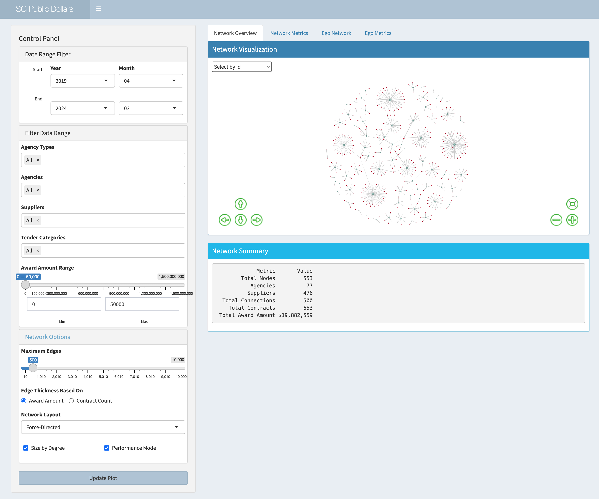{fig-align="center"}

**Figure 1.1 Proposed network overview**

The figure below show some of the interactive features that will be in the development of the Overview page. The main objective of this page is to allow users to have a full picture of the relationships spread.

User is able to narrow down the agencies by selecting agency type first. They can also focus on certain category of procurement to analyse the networks.

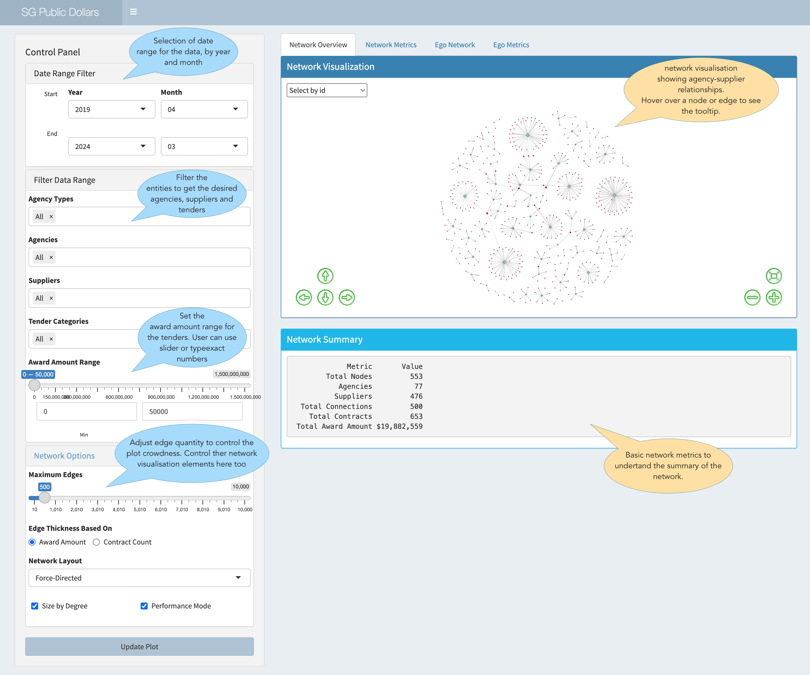

### Section Two (Network Metrics)

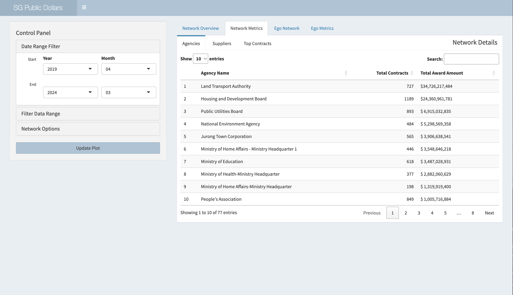

**Figure 1.2 Proposed metrics layout for network overview**

This is the proposed detailed metrics table for the network on the first section. Over here user can use keyword to search the data pertaining to agencies, suppliers and tenders. User is able to identify who are the top agencies, suppliers and contracts (by award amount) in this network. They can also leverage the data sorting feature.

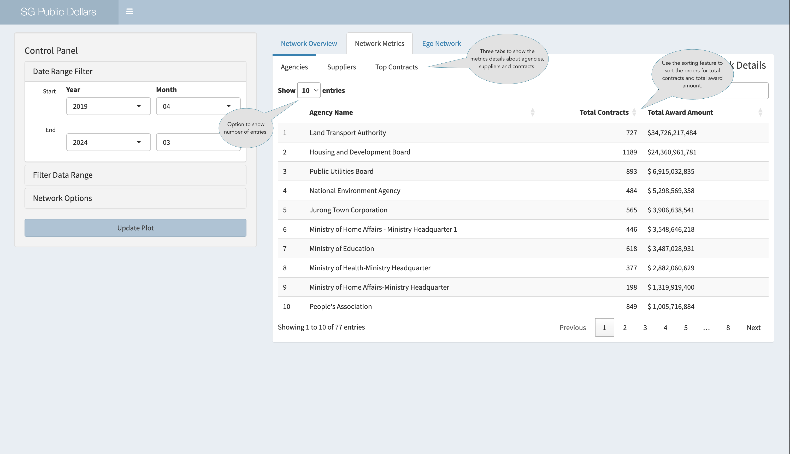{fig-align="center"}

### Section Three (Ego Network)

The proposed layout for Ego Network is to have the visualisation on top of the summary metrics, similar to the main network section for consistent design.

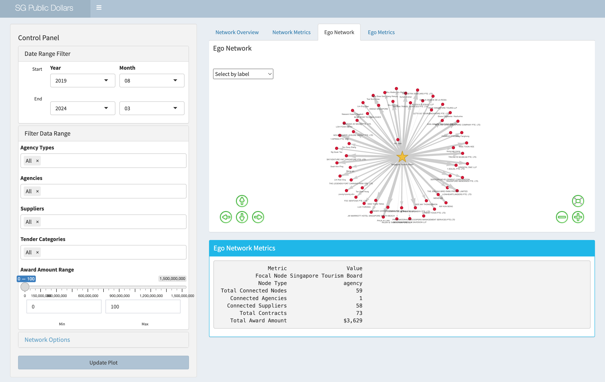

**Figure 1.3 Proposed Ego centric network layout for selected node**

This section allows users to have a exclusive view of the selected node and all of its connections. The selected node is shown as a star shape. If the connected node is a supplier, they will show in a dot shape, and agencies will show in a diamond shape.

The labels are shown automatically. When users hover over the nodes and edges, they can get detailed information related to the node/edge. Note that the information for nodes are not just for the ego centric network. It is calculated using the selected network's data.

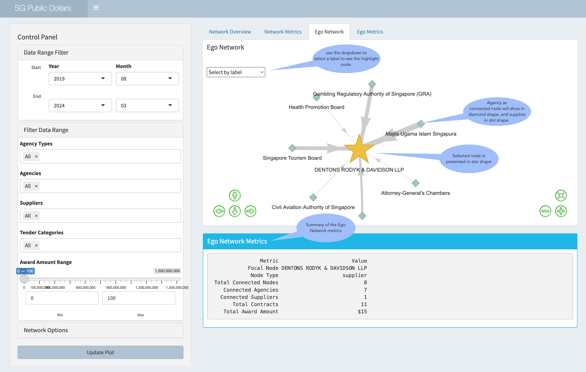{fig-align="center"}

### Section Four (Ego Metrics)

This section is to show a metric table for the Ego Network. The design is the same as the metric table for the main network. The difference is that this table shows a smaller sets of data as it's derived from the Ego Newtwork. The reason it's separated from the visualisation is to optimise user experience so that they do not have to scroll down to view the table as the page would become long.

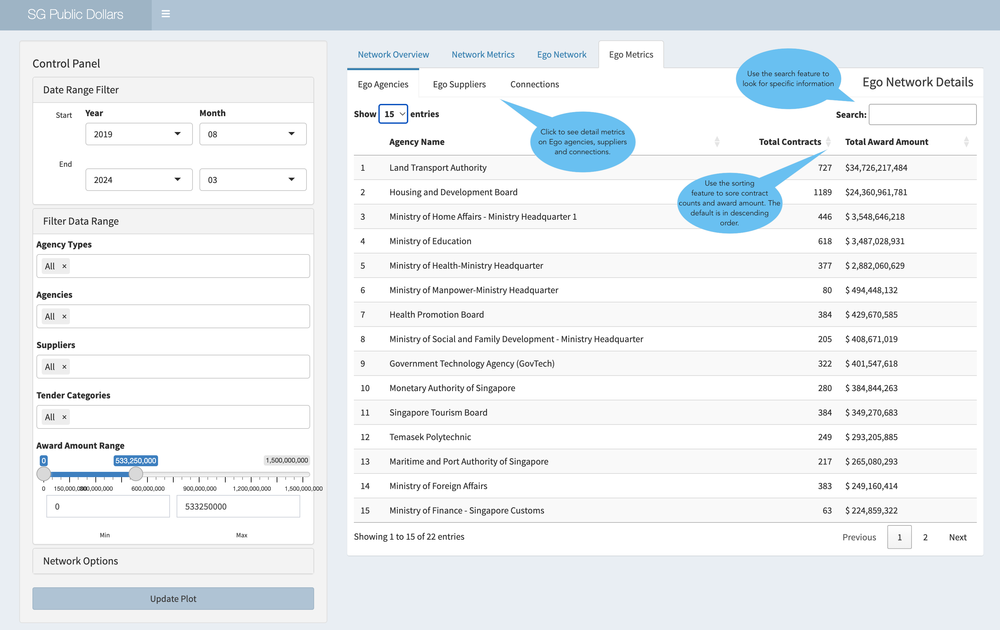{fig-align="center"}

**Figure 1.3 Proposed metric table layout for the Ego centric network**

### 5.2 Community Network

In this Network Overview module, the application has 3 main sections. It focuses solely on network community analysis. The design rationale is to have an overview of the network with colors to distinguish the communities identified by an algorithm. There are three sections dedicated to this module.

The first section is the overview of network communities that shows the visualisation, basic metrics and a bar char visualisation to show community distribution.

The second section is to show the Ego community as selected by the user, and the important metrics is revealed in this page on the top.

The third is the metric table for the Ego community, showing the node, node type, and the metrics of the different centralities.

### Section One (Community Network)

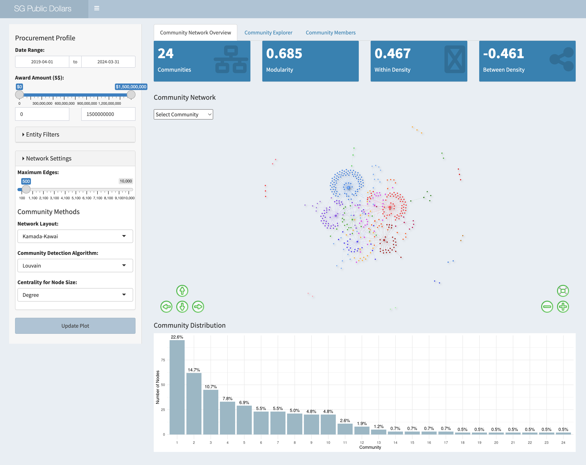{fig-align="center"}

**Figure 2.1 Proposed network community overview of the module**

The figure below show some of the interactive features that are planned in the development of the overview page. The main objective is to provide users to have a good idea of the community spread within the data range. Users are able to leverage the control panel to define the data they want to use for analysis, including date range, agency type, agencies, supplies and tender type.

They can also use the network visualisation settings to control the number of edges shown in the plot, the network layout and community detection methods, depending on the different needs.

A synchronised view in the ***Community Explorer*** tab when user use the drop-down to highlight a community will be implemented. User will then be able to see the focused view of the selected community in ***Community Explorer*** tab.

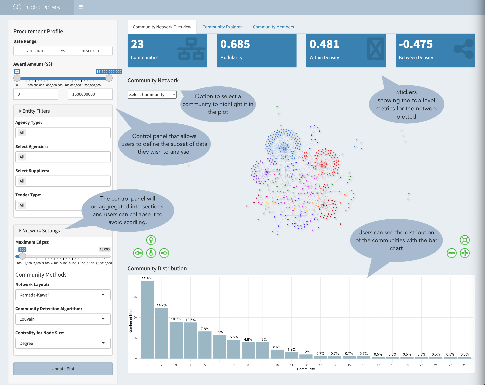{fig-align="center"}

### Section Two (Community Ego Visualisation)

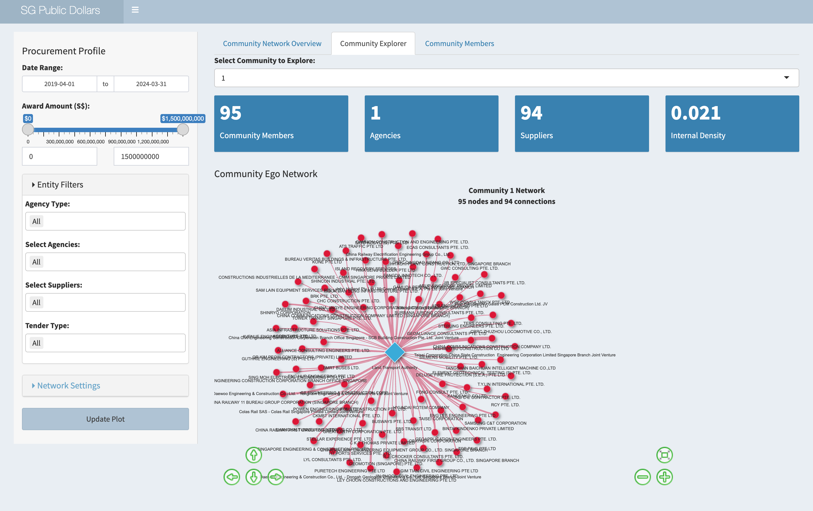{fig-align="center"}

**Figure 2.2 Proposed design for Ego network community view**

Visualisation appears in this section appears when a community is selected using the dropdown in the ***Community Network Overview*** tab. All nodes within the community will be plotted.

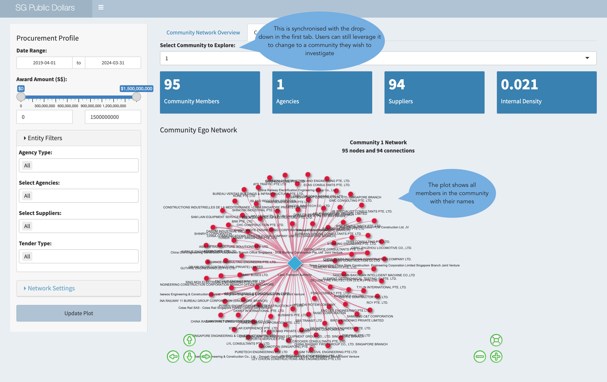{fig-align="center"}

### Section Three (Community Members Metrics)

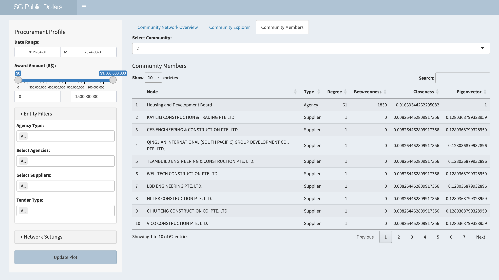{fig-align="center"}

**Figure 2.3 Proposed layout for the Ego community metric table**

This section is to separate the metric table from the Ego community visualisation, showing the nodes and centrality information. Users can still toggle between different community and get a real-time update on the metrics.

## 6. Next steps

## 7. References

Ministry of Finance. (2016). Government Procurement via GeBIZ (2024) \[Dataset\]. data.gov.sg. Retrieved March 30, 2025 from <https://data.gov.sg/datasets/d_acde1106003906a75c3fa052592f2fcb/view>

https://bookdown.org/markhoff/social_network_analysis/network-visualization-and-aesthetics.html

<https://medium.com/data-science/community-detection-algorithms-9bd8951e7dae>

Gibson, H., Faith, J., & Vickers, P. (2013). "A survey of two-dimensional graph layout techniques for information visualization." *Information Visualization*, 12(3-4), 324-357.
