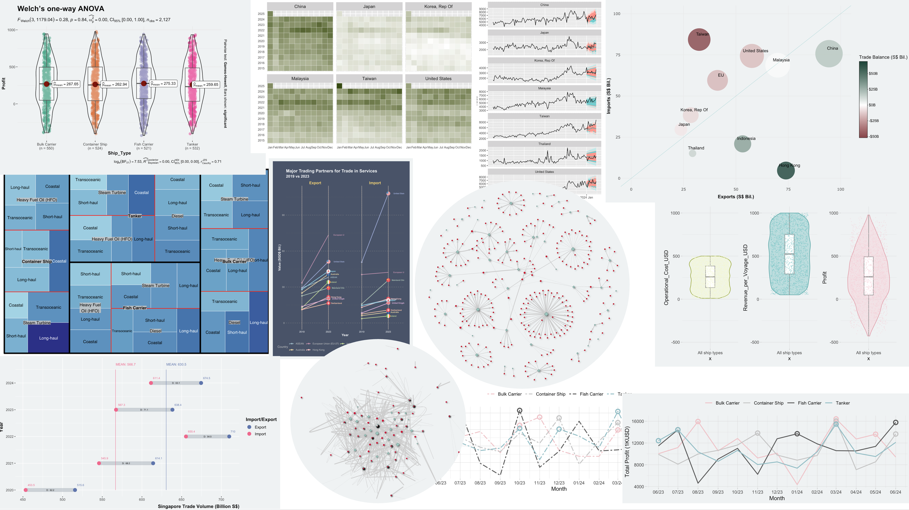

### **Welcome to Cathy's portfolio** {width="100"}

This webpage serves as a portfolio showcasing my coursework for ISSS608 Visual Analytics and Application at Singapore Management University.

Throughout this website, I share exercises, assignments and projects completed during the course. I welcome connections with visitors who wish to discuss analytics questions and insights.

The course has introduced me to various data visualisation methods, with "R for Visual Analytics" serving as the primary textbook for these works. I extend my sincere thanks to Professor Kam for sharing his extensive knowledge and for his patience in guiding us through the Visual Analytics universe!

### 
